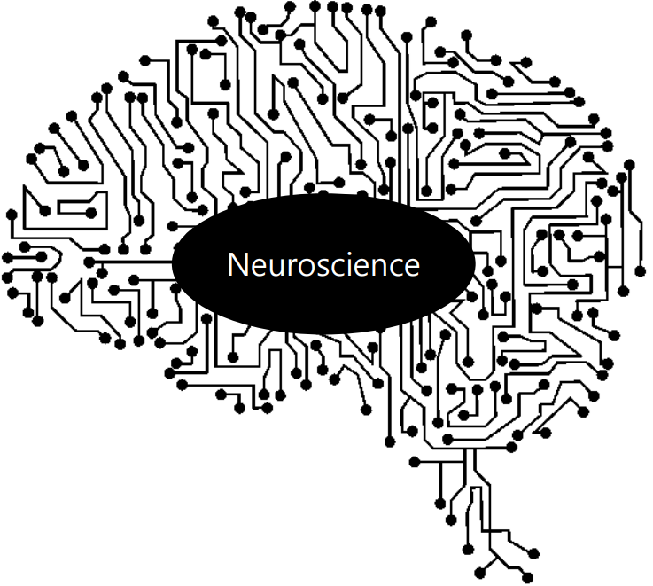
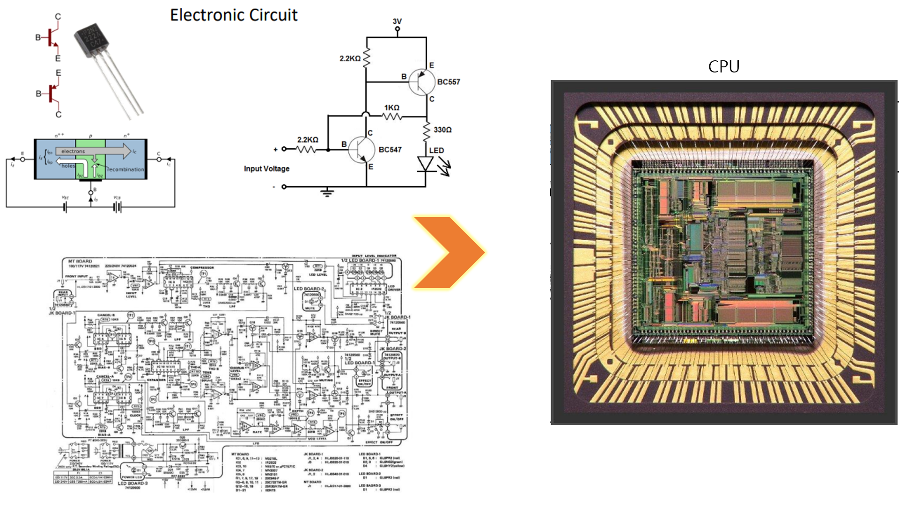
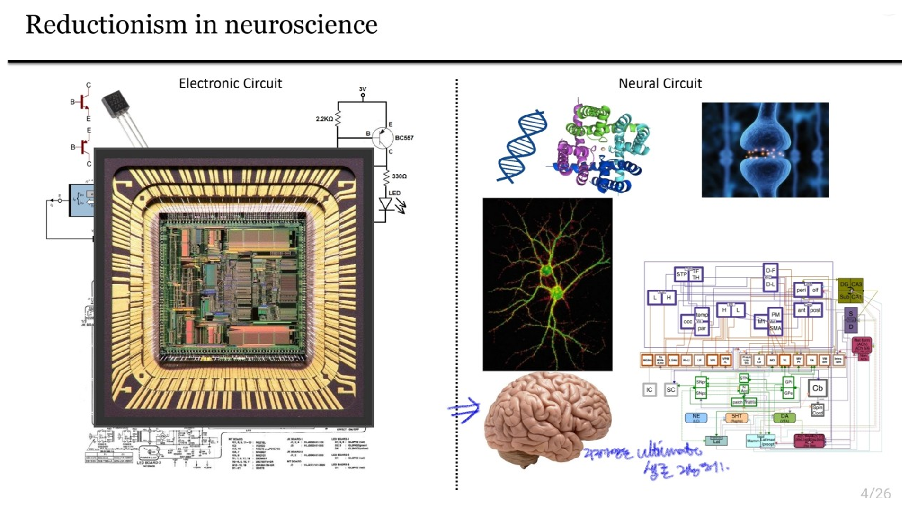
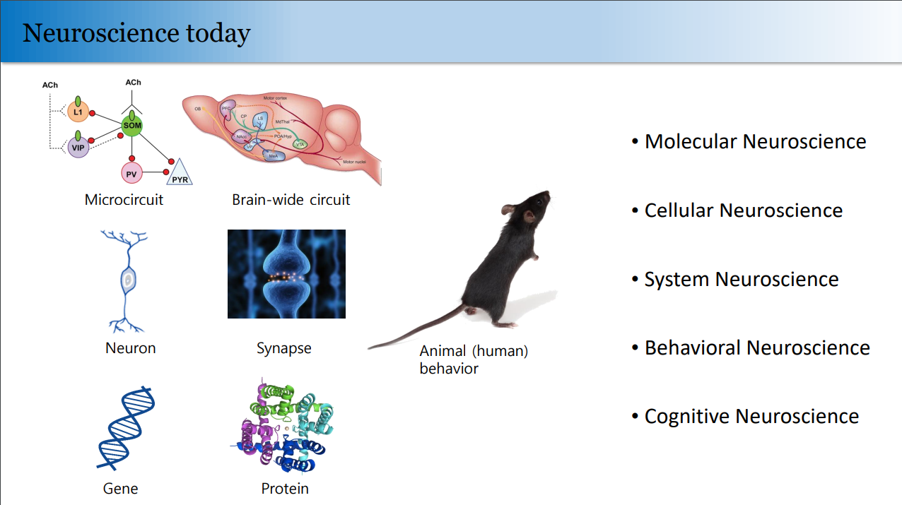
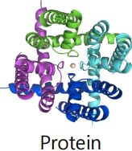
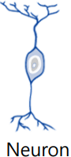
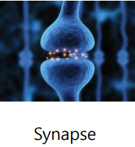
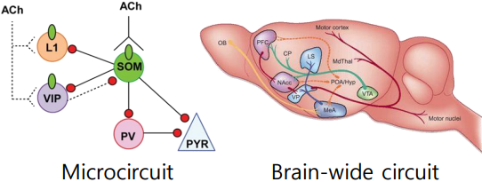
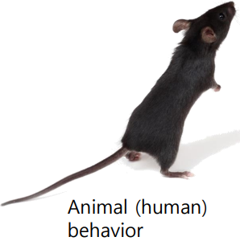
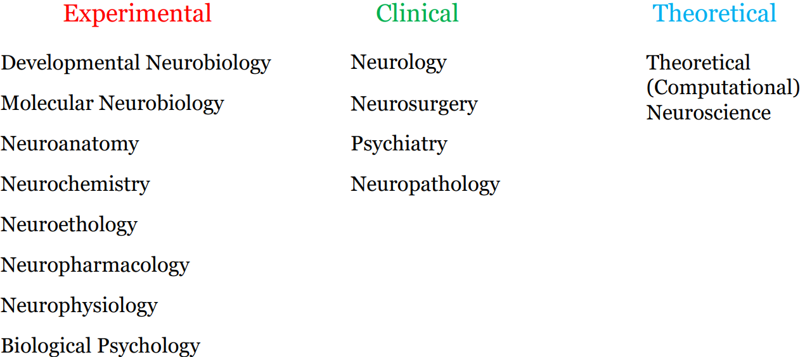

안녕?

이 블로그 글에서는 내가 배운 신경과학 내용들을 다룬다.

### 신경과학이란?

한마디로 신경과학은, "지능"을 배우는 학문이다.

"지능"은 주변 정보를 습득하고, 종합 분석해서, action을 취하거나 의사결정을 내리는 활동,

또는 이를 가능하게 하는 SW(SoftWare)나 HW(HardWare)를 의미한다.

생명체일 필요는 없다. 그래서 "인공지능"도 지능의 한 예이다.

신경과학은 Reductionism의 성향을 가진다.

Reductionism, 환원주의는 작은 것부터 이해해서 큰 것을 이해한다는 것이다.

우리가 뇌를 통해 어떻게 사고하게 되고, 의사결정을 내리고, 감정을 가지게 되는지를 gene(유전자), molecular(분자), cellular(세포) level부터 시작해서 알고자 한다는 것이다.

뇌에 그럼 잠깐 focus를 맞춰보자.

뇌는 사람에게 있어서 기계의 CPU와 같다고 한다.

여러가지 circuit을 모아서 만들어놓은 지능.

실제로 이 작은 '반도체'로 우리는 SW만 깔면 투자도 하고, 이 사이트도 만들고, 게임도 하고, 계산기도 돌릴 수 있다. 거의 만능이다.

이와 비슷하게, 우리의 뇌도 여러가지 신경세포(neuron)들이 모인 neural circuit이 모여 만들어진 지능이다.

인류가 언제 멸종할지는 모르겠지만, 인간들이 지구 여기저기에 분포하여 종별 생존 경쟁으로부터 자유로운 현재로서는

인간의 뇌가 궁극의 생존 지능체라고 볼 수 있겠다.

우리는 이 뇌를 이해하고자 한다.

### 신경과학의 역사

#### ~르네상스 전

#### 르네상스 ~ 18세기

#### 19세기

### 신경과학의 분야

#### 신경과학의 다섯 가지 분석 단계

오늘날에 NeuroScience는 분석 단계에 따라서 5종류로 나뉜다.

1. Molecular Neuroscience (분자신경과학)
 
  뇌는 우주에서 가장 복잡한 물질이라고 한다.

  뇌에는 환상적으로 다양한 종류의 분자들이 있고, 이 분자들이 우리 뇌가 기능하는데 중요한 역할을 담당한다.
  
  예를 들어 우리 뇌의 뉴런(=신경세포=neuron)들이 서로 소통하는 매개체(messenger)로서, 
   neuron에서 물질 출입을 허가하는 보초(sentries)로서,
   신경 성장을 조율하는 지휘자로서,
   과거 경험의 기록 보관소로서의 역할이다.
   우리 뇌에서 이런 기능들이 어떤 분자들을 통해 이루어지는지를 공부하는 가장 기본적인 학문이 Molecular Neuroscience이다.

2. Cellular Neuroscience (세포신경과학)
   
  다음 단계의 분석은 이러한 분자들이 어떻게 상호작용해서 뉴런들에 특별한 기능을 부여하는지를 연구하는 Cellular Neuroscience이다.

  다음과 같은 질문들을 다룬다:
   - 세상에는 몇 가지 종류의 뉴런이 있을까? 그것들이 기능적으로 어떻게 다를까?
   - 그 뉴런들이 다른 뉴런들에 어떻게 영향을 끼칠까?
   - 뉴런들이 어떻게 태아의 발달기때 연결될까?
   - 어떻게 뉴런들이 서로 다른 계산을 수행할까?

3. Systems Neuroscience (시스템 신경과학)
    
   공통된 기능을 수행하는 수많은 Neuron들이 모여 visual system, motor system 등의 복잡한 neural circuit (신경 회로)을 형성한다.
   Systems Neuroscience는 이러한 neural circuit들을 다루는 학문이다.
   다음과 같은 질문들을 다룬다:
    - 서로 다른 neural circuit들이 어떻게 감각 정보를 분석하고,
    - 바깥 세계에 대한 지각을 형성하고,
    - 선택을 내리고,
    - 움직임을 수행할까?
  
4. Behavorial Neuroscience
   
   어떻게 이런 neural system이 협동해서 통합된 행동을 만들어내는지를 다루는 학문이다.
   다루는 질문들의 예를 들자면,
    - 기억 형식의 다양성이 system(여기서는 ==신경 회로)의 다양성으로 설명될 수 있을까?
    - "마음을 바꾸는" 약들이 뇌의 어느 시스템에서 작용하고,
    - 그 system이 정서와 행동에 보통 어떻게 기여할까?
    - 어떤 신경회로 시스템이 성별 특이적인 행동을 설명할까?
    - 꿈이 어디에서 만들어지고 그것들이 무엇을 나타낼까?

5. Cognitive Neuroscience

   아마도 신경과학에서 제일 큰 난제는 자의식, 상상, 언어와 같은 사람의 높은 단계의 정신 활동에 관여하는 신경 매커니즘이 아닐까.

   이런 단계에서의 연구인 cognitive neuroscience는 어떻게 뇌의 활동이 '마음'을 형성하는지를 다룬다.

다음 그림과 같이 3가지로 나뉘기도 한다.

### 과학으로서의 신경과학

