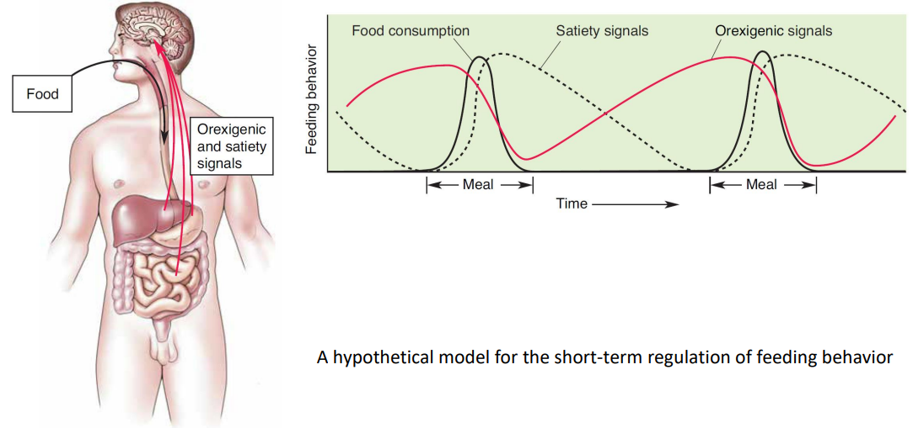

### 서론

Conscious movements occur by the behavior which acts as the driving force on a behavior. 
Neuroscience cannot yet provide a detailed explanation on for why the sailing expedition was abandoned in favor of writing this chapter. Nonetheless, much has been learned about what motivates certain behaviors that are basic to survival.

### 1. The hypothalamus, homeostasis, and motivated behavior

The hypothalamic regulation of homeostasis occur as follows:

1. Sensory transduction.
- A regulated parameter (e.g. temperature) is measured by specialized sensory neurons.
- Deviations from the optimal range are detected by the neurons in the periventricular zone of hypothalamus.
1. 3 types of responses by hypothalamus to maintain bodily homeostasis
   1. Humoral response: stimulate/inhibit releasing pituitary hormones.
   2. Visceromoter response: adjusting the balance of sympathetic and parasympathetic outputs of ANS.
   3. Somatic motor response: Hypothalamic neurons (particularly within lateral hypothalamus) incites an appropriate somatic motor behaviorial response.

❗단어들❗ 

| 단어 | 뜻 |
| :---: | :---: |
| motivated behavior | Behavior that is incited to achieve a goal.    e.g. (by somatic motor system) to actively seek or generate warmth by moving, to drink water, & to eat. |

Chapter Goal:
- Explore the neural basis for this type of motivation.

To illustrate, focus on a subject: eating.

### 2. The long-term regulation of feeding behavior

#### 2.1. Energy Balance

Loading and emptying the body's energy reserve

2 kinds of reservoir: Glycogen and Triglycerides.

| substances | Location | Capacity |
| :---: | :---: | :---: |
| glycogen | skeletal muscle & liver | limited |
| triglycerides | adipose (fat) tissue | unlimited |

❗단어들❗

| 단어 | 뜻 | 단어 | 뜻 |
| :---: | :---: | :---: | :---: |
| prandial state | The condition in which the blood is filled with nutrients(when we begin the process of digestion) | postabsorptive(=fasting) state | The fasting condition between meals (fast: 굶다) |
| anabolism  (= anabolic metabolism) | Assembly of macromolecules from simple precursors. | catabolism (= catabolic metabolism) | Process of breaking down complex macromolecules |
| obesity | A state of **positive** energy balance in which  energy intake & storage **exceed** energy expenditure, resulting in an *increase* in body fat. | starvation | A state of **negative** energy balance in which  energy intake **fails** to meet the body's demands, resulting in a *loss* of fat tissue. |

#### 2.2. Hormonal & Hypothalamic Regulation of Body Fat & Feeding

##### Body Fat and Food Consumption

❗단어들❗

| 단어 | 뜻 |
| --- | --- |
| lipostatic hypothesis | The idea that the brain monitors the amount of body fat and acts to "defend" this energy store against perturbations (i.e. changes) |
| parabiosis | Union between two living organisms that share a common vascular system |
| leptin | A protein hormone released by adipocytes (fat cells) that communicates with neurons of the arcuate nucleus of the hypothalamus |

The energy homeostasis is maintained.

A possible mechanism: **Lipostatic hypothesis**. 
: The idea that the brain monitors the amount of body fat, acting to defend this energy store against perturbations.

For this hypothesis to be true, a necessary condition is the communication from body fat to feeding behavior, i.e., from the adipose tissue to the brain.

This is confirmed by Douglas Coleman as follows:

##### Studies from ob/ob mice

ob/ob mice (lacking both copies of a gene called ob): very obese, abnormally motivated to eat.

Coleman's hypothesis: The product from the ob gene may be the hormone telling the brain that fat reserves are normal('enough').

1. Parabiosis experiment (1906s, Coleman & his colleagues)
   - parabiosis: First introduced by the French physiologist Paul Bert in the 1860s.
   - parabiosed entities share a *common blood supply*.
   - an ob/ob and normal mice were parabiosed => Feeding behavior and obesity were **greatly reduced**.
  
   : The effects by missing hormone?
2. Effects of leptin (1994, Jeffrey Friedman @ Rockfeller Univ.)
   - leptin: The protein encoded by the ob gene.
     - Generation & Secretion: adipose cells (adipocytes)
     - Target: Neurons of the **arcuate nucleus** of the **hypothalamus**.
     - 'body fat is enough'
     - Result:
       - Decrease appetite
       - Increase energy expenditure
   - Leptin deficiency: Adaptive when food is scarce & E reserves are low.
     - stimulate hunger & feeding
     - suppress energy expenditure
     - inhibit reproductive competence

##### The Hypothalamus & Feeding

- Lesion Experiment (Dr. Hetherington & Dr. Ranson)
  Bilateral lesions of...
  - *Lateral* hypothalamus
    ❗단어들❗

    | 단어 | 뜻 |
    | --- | --- |
    | anorexia | a state of negative energy balance in which energy expenditure exceeds energy intake, with a severe damage to food appetite |
    | lateral hypothalamic syndrome | anorexia caused by damage to the lateral hypothalamus |

  - *ventromedial* hypothalamus
    ❗단어들❗

    | 단어 | 뜻 |
    | --- | --- |
    | ventromedial hypothalamic syndrome | overeating and obesity caused by lesions to the ventromedial hypothalamus |

Dual center model:
- Lateral hypothalamus: "hunger center"
- Ventromedial hypothalamus: "satiety center"

Too simplistic!

##### The effects of leptin on the hypothalamus

❗단어들❗

| 단어 | 뜻 | 단어 | 뜻 |
| :---: | :---: | :---: | :---: |
| anoretic peptides | A neuroactive peptide that acts to inhibit feeding behavior; examples are CCK, αMSH, and CART. | orexigenic peptide | A neuroactive peptide that stimulates feeding behavior; examples are neuropeptide Y (NPY), agouti-related peptide (AgRP), melanin-concentrating hormone(MCH), and orexin. |

❗단어들❗

| 단어 | 뜻 |
| --- | --- |
| arcuate nucleus | A nucleus in the periventricular area of the hypothalamus containing a large number of neurons sensitive to changes in leptin levels, contributing to the regulation of energy balance
| paraventricular nucleus | A region of the hypothalamus involved in the regulation of the autonomic nervous system and in controlling the secretion of thyroid-stimulating hormone and adrenocorticotropic hormone from the anterior pituitary. |
| lateral hypothalamic area | A poorly defined region of the hypothalamus that has been implicated in the motivation of the behavior. |

Fig 16.7

1. leptin activates leptin receptors on neurons of the **arcuate nucleus**.
2. activating *arcuate neurons* containing peptide ntms **αMSH** and **CART**, proportional to the blood leptin level.
3. The **αMSH/CART** neurons trigger *humoral* and *visceromotor* response via **paraventricular nucleus**.
   1. activate neurons in the paraventricular nucleus that causes the release of hypophysiotropic hormones that *facilitates* the *release of TSH and ACTH* from the anterior pituitary. (=> raising metabolic rate of cells throughout the body)
   2. The **paraventricular nucleus** also activate the *sympathetic ANS*
      1. with direct axonal projections to neurons in the lower brain stem and
      2. to preganglionic neurons in the spinal cord.
4. The **αMSH/CART** neurons also trigger behavorial response via the **lateral hypothalamus**. => inhibit feeding behavior

Fig 16.8

1. Fall in leptin => not only turn off **αMSH/CART** neurons, but also *stimulate* **NPY/AgRP neurons of the arcuate nucleus**.
2. The neuropeptides... (via **paraventricular nucleus**)
   1. inhibit the paraventricular nucleus that stimulate the release of TSH and ACTH.
   2. activate parasympathetic division of the ANS
3. It also, (via **lateral hypothalamus**)
   1. *Stimulate* feeding behavior

Fig 16.9

Fig 16.10

| Leptin level | elevated | decreased |
| :---: | --- | --- |
| nyum nyum | | |

Note that AgRP(agonist) and αMSH(antagonist) are antagonistic neurotransmitters 
both binding to the **MC4 receptor** on some postsynaptic neurons in the hypothalamus. 
Activation of MC4 receptors on **lateral hypothalamic neurons** inhibit feeding; inhibition stimulates feeding. 

Fig 16.11

##### The Control of Feeding by Lateral Hypothalamic Peptides

Lateral hypothalamic area
- Not organized into well-defined nuclei.
- involved in motivating feeding behavior.

2 groups of neurons of **lateral hypothalamic neurons** with...
  - Direct input from arcuate nucleus
  - Widespread cortical connections in the brain

1. MCH (melanin-concentrating hormone)-containing neurons
   1. Direct monosynaptic innervation of *most* of the cerbral cortex.
      1. System in a strategic position to inform the cortex of leptin levels in the food.
      2. **Motivating search for food**. Evidences:
         1. Injection of MCH into the brain stimulates feeding behavior.
         2. MCH lacking mutant mice: less feeding behavior, lean(, elevated metabolic rate)
2. orexin(==hypocretin)-containing neurons
   1. Stimulates feeding behavior.
   2. as hypocretin : important in the regulation of *wakefulness*.

They are complementary. e.g.
- orexin: promotes meal initiation.
- MCH: prolongs consumption.

cf. disabling orexin (==hypocretin) signaling => **excessive daytime sleepiness**.

cf. orexin(hypocretin) provides an interesting link between the conditions...
1. sleep inhibits feeding behavior(less orexin).
2. insomnia and obesity often go together (excessive orexin).

### 3. The short-term regulation of feeding behavior

'short-term' : 하루

satiety signal : A factor that reduces the drive to eat without causing sickness; examples are gastric distension and cholecystokinin released by the intestinal cells in response to food.

#### Appetite, Eating, Digestion, and Satiety

Body's rxn during eating something
1. Cephalic phase
   1. The sight and smell of the pancakes trigger a number of physiological processs that anticipate the arrival of brakfast. The parasympathetic and entric divisions of the ANS are activated, causing the secretion of saliva into your mouth and digestive juices into your stomach.
2. Gastric phase
   1. These rsponses grow much more intense, whn you start chewing, swallowing, and filling your stomach with food.
3. Substrate (intestinal) phase
   1. As your stomach fills and the partially digsted pancakes move into your intestines, nutrients begin to be absorbed into your bloodstream.

Orexigenic and satiety signals shaping eating behaviors during a meal

1. Ghrelin (orexigenic)
   - Location:
     - Highly Concentrated **in the stomach**.
   - Trigger:
     - Released into the bloodstream when the stomach is empty.
   - Function:
     - Activate NPY/AgRP neurons of the arcuate nucleus
      => Strongly stimulates appetite and food consumption.

    Isolated originally as a factor that stimulates GH release.

2. Gastric Distension (Stretching of the stomach wall. Powerful satiety signal)

    - Location: stomach wall.
      - stomach wall : richly innervated by mechanosensory axons, mostly ascending to the brain via the **vagus nerve**.
    - Trigger: stomach being 'full'(?)
    - Function: Inhibits feeding behavior.
      - vagal *sensory* axons activate neurons in the **NTS**(nucleus of the sollitary tract, used frequently) in the *medulla*, inhibiting feeding behavior.
   
   cf. the NTS...
   - receives direct snsory input from the taste buds from the gustatory nucleus, a subdivision.
   - is also an important center in th control of the ANS.
   - receives visceral sensory input from the vagus nerve.
   - => important integration center!
  
   - If food is tasty enough, satiety can be delayed quite a while.

3. Cholecystokinin (satiety signal)
   - Location
     - Present in the cells lining the intestine and some of the neurons of the NS.
   - Release:
     - Stimulation of intestine by certain types of food. (especially fatty ones)
   - Target:
     - Vagal sensory axons. (synergistically with gastric distension)
   - Function:
     - inhibits meal frequncy and size.
     - Inhibits feeding behavior (working synergistically with gastric distension on vagal sensory axons.)
     - Fig 16.13

    CCK is also in some CNS neurons.

4. Insulin
    - Location:
      - Maybe from the pencreas.
    - Release:
      - Into the bloodstream by the pencreas β cells.
    - Trigger: ("less 중요")

        Figure 16.14
      - anticipation of food in cephalic phase
        - Parasympathetic ANS (via the vagus nerve) stimulate β cells of the pencreas to release insulin
        - => Blood glucose lvl slightly falls => increasing drive to eat (partially via activation of the NPY/AgRP neurons)
      - Gastric phase
        - By gastrointestinal hormones (CCK)
      - Substrate phase
        - Rise of blood glucose level.
        - Food is finally absorbed => Maximal.
    - Function:
      - **Vital** for glucose transport into the other cells of the body.
      - Important for...
        - anabolic metabolism: glucose transport
          - into liver, skletal muscle, and adiposee cells for storage.
        - catabolic metabolism: glucose liberated from storage sites taken up as fuels by the other cells of the body.
      - Tightly regulates the level of glucose in blood
        - Ins lvl rise => Blood glucose lvl reduce.

    Acts directly on the arcuate and ventromedial nuclei of the hypothalamus to inhibit feeding behavior (like leptin).

Figure

### 4. Why do we eat?

Like vs Want

1. Liking (hedonic): It feels good to do it.

    e.g. We eat food because we like it (and get pleasure from it.)

2. Wanting : drive reduction, satisfy a craving. / 'Need' it.

    e.g. We eat food because we want it (it is necessary for me to eat the food)

#### 4.1. Reinforcement and Reward

#### 4.2. The Role of Dopamine in Motivation

#### 4.3. Serotonin, Food, and Mood

### 5. Other motivated behaviors

### Concluding Remarks
