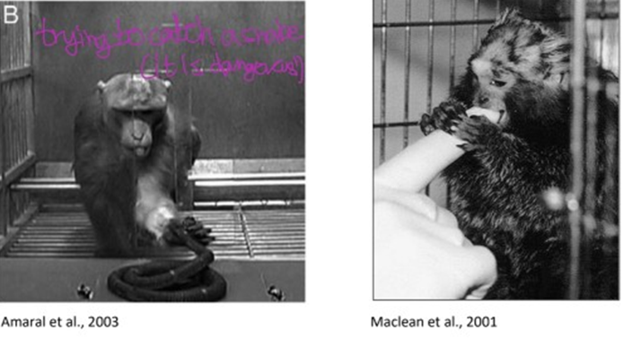
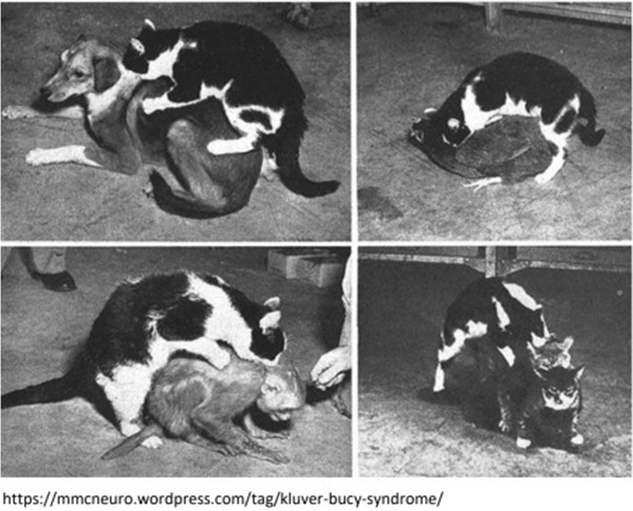
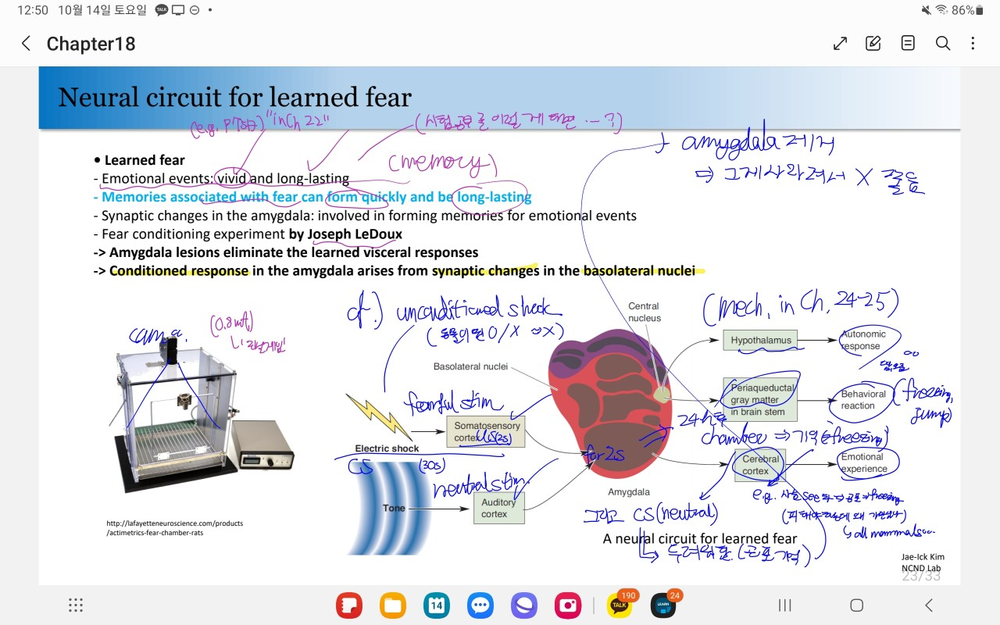

### Introduction

"Affection : 감정"

Affective Neuroscience: The study of the neural basis of mood and emotion.

Terms:

- emotional experience (feelings)
- emotional expression ('emotional reaction'. Both somatic and visceral. e.g. fight-or-flight response.)

### 1. Early Theories of Emotion

What exactly is the definition of the feelings of emotions?

**Darwin's observations**

: - People in *different* cultures experience the *same* emotions.
: - *animals* appear to express *some* of the *same* emotions as humans.

#### 1.1. The James-Lange Theory

| A theory proposing that the **subjective experience** of emotion is a **consequence** of **physiological changes**(emotional expression) in the body. |

i.e. *emotional expression* causes *emotional experience*.

e.g. You **feel sad** when you **sense** that you are crying.

| - emotional expression : sense of my crying |
| - emotion : sadness |

This does not mean that the emotion cannot be felt in the absnce of obvious physiological signs.

But for strong emotions that are typically associated with physiological change, they say that this is true.

#### 1.2. The Cannon-Bard Theory

| A theory of emotion proposing that emotional experience is **independent** of emotional expression and is determined by the pattern of **thalamic activation**. |

##### Focus

- **thalamus** plays a special role in emotional sensations.
  - Emotion is devoid of *stimulus-response neural loop*.
    - *sensory input* is received by the cerebral cortex, which in turn *activates* certain changes in the body, independent of emotion.

  - Emotion production: Signals reach the thalamus
    - i.e. **pattern of activation** of the **thalamus** determines the **character of emotion**.
    - Neglecting the physiological response to the sensory input.

##### Difference with James-Lange Theory

1. emotions can be experienced even if physiological changes cannot be sensed.
   1. e.g. animal experiment
        : transection of the spinal cord.
        : => Eliminate body sensation, emotion is not abolished. (detected by muscular control.)
   2. e.g. human cases; transected spinal cord did not diminish emotion.
2. Lack of a reliable correlation between the exp of emotion and the physiological state of the body.
   
   e.g. fear: accompanied by...

    1. increased heart rate
    2. inhibited digestion
    3. increased sweating
   
   : However, the **same physiological changes also comes along with other conditions**.
    - anger (other emotion)
    - fever (nonemotional condition)

    => Fear being a consequence of the changes: absurd.

... 프린트물에 나온 내용까지만 알아도 된다고 한다.

##### Illustration of the difference.

Crying and Sadness

- James-Lange Theory
  : - You feel sad as you sense that you are crying.
  : - Preventing the crying would perish the sadness.
- Cannon-Bard Theory
  : - You don't have to cry to feel sad.
  : - There simply has to be the appropriate activation of your thalamus in response to situation.  

cf. It is difficult to study.

Difficulties in the study of emotion in animals
- cannot ask an animal how it feels.
- Can only measure its physiological or behavioral manifestations

#### 1.3. Implications of Unconscious Emotion

Terms

- unconscious emotion
    : The experience or expression of emotion in the absense of conscious awareness of the stimulus that evoked the emotion.

(무의식으로 차량번호 image가 있음 : 사람에 따라 최면술로 밝힐 수도 있다고 한다.)

Experiment:

| case | Perception | Conductivity of skin (high/low) (Reaction of the ANS) |
| :---: | :---: | :---: |
| Expressionless face | Expressionless face | low (no effect)
| Angry face + unpleasant sound | Angry Face | high (increased skin conductance)
| 24장/1초 => 거의 안 보임. 여러 장 사진 중 딱 하나 Angry Face! | Expressionless Face (NOT angry!) | HIGH!

+ PET scan showed : inc skin conductance <-> amygdala activity.

=> Despite the faces are not perceived, the presentation of angry faces is both correlated with the **autonomic response** and **amygdala activity**.

Emotional **Experience** is **not always a prerequisite** for emotional **expression**.

### 2. The Limbic System

system : Collection of the components of a pathway.

e.g. parts of the *visual system* : work together to serve vision.
- lateral geniculate nucleus
- striate cortex

Is there a system that **processes the experiencing of emotions**?

Answer : limbic system (But this is not a single system)

Limbic system : 변연계

#### 2.1. Broca's Limbic Lobe

- limbic lobe
  : The hippocampus and cortical areas *bordering* the **brain stem** in mammals, which Broca proposed as a distinct lobe of the brain.  
  : cf. limbus : border, 경계.
  : cf. \(limbo : 연옥. 지옥가기 전에 가는 데라고 함\) in 기독교.

    예수님이 태어나기 전에 태어난 사람은 어디로 가는가? (예수에 의해 구원받는다는데)
    죽은 아기는 죄가 없는데 어디감?

    => 천국과 지옥의 **중간**, limbo

Components:

  - cortex around the *corpus callosum* ( mainly the **Cingulate gyrus** (좌/우뇌가 서로 맞닿아있는 영역 중 아랫쪽. 아주 중요함))
  - cortex on **Medial surface** of the **temporal lobe** (안쪽면)
  - Hippocampus (temporal lobe의 앞쪽의 안쪽의 옆면...)

Originally thought to have nothing to do with emotion. Primarily in olfaction. Connections with emotions were found later.

#### 2.2. The Papez Circuit

- papez circuit : A circuit of structures interconnecting the hypothalamus and cortex, proposed by Papez to be an emotion system.
- cf. fornix : A bundle of axons that originates in the hippocampal formation, loops around the thalamus, and terminates in the diencephalon.
- limbic system : A group of structures, including those in the limbic lobe and Papez circuit, that are anatomically interconnected and are probably involved in emotion, learning, and memory.

A number of limbic structures are involved in emotion (supported by evidence.)

  - Rabies is characterized by hyperemotional responses.
  - An indication : abnormal cytoplasmic bodies in neurons especially in the hippocampus.
  - => Hypothalamus must be involved in normal emotional experience. (Though this was not so true.)

- P1 : Hippocampus, fornix
- P2 : Anterior nuclei of thalamus

| role | handled by | input from | output tgt |
| :---: | :---: | :---: | :---: |
| **emotional exprssion** (behavorial) | Hypothalamus | (P1)Hippocampus, fornix | (P2)Anterior nuclei of thalamus
| **emotional experience** | Cingulate Cortex (in CC) | *Neocortex*, (P2)Anterior nuclei of thalamus | *Neocortex*, (P1)Hippocampus, fornix
| **emotional coloring** (e.g. 같은 sad 중 강도에 따라, 같은 '기쁨'에 대해서도 어떤 일로 인해 느꼈는지를 구분.) | *Neocortex* | Cingulate Cortex (in CC) | Cingulate Cortex (in CC)

- Note that the graph is circular. (i.e. has no starting point.)
    e.g. 공포를 느낌 => hippocampus => 땀흘림 => anterior nuclei of thalamus => 공포를 느낌 => ...

- It is also bidirectional => compatible with both the James-Lange & the Cannon-Bard theories of emotion.
 - James-Lange Theory : via (P2) Anterior nuclei of thalamus. (from the hypothalamus to cingulate cortex)
 - Cannon-Bard Theory : via (P1) Hippocampus and Fornix (from the cingulate cortex to the hypothalamus)

cf. Box 18.2 Phineas Gage

    전두엽 damage. => 감정에도 큰 변화가 일어났다. 
    * 교통사고 시 전두엽 이상은 주의깊게 살펴봐야 한다.
    * 의사결정, 집행, etc.

limbic system : Papez circuit (called by the similarities between the elements of the Papez circuit and Broca's limbic lobe.)

#### 2.3. Difficulties with the Concept of a Single System for Emotions

- Some of the structures in Broca's limbic lobe and the Papez circuit play a role in motion.
- Others are not critical for the motion (e.g. hippocampus)

Current Conclusion : There is not a single, discrete emotion system.
Instead, Several brain regions are involved in emotion, and these areas also mediate other functions.

(Structure and Function not one-to-one!)

cf. e.g. cingulate gyrus :
- emotion
- 초장기기억
- ~~~

### 3. Emotion Theories and Neural Representations

이전에는 brain injury나 disease로 damage to a brain structure altering the emotion (experience, expression)을 보았다. => 이게 normal한 emotional function에 중요함을 추론했다. 
Unfortunately, 이렇게 consequences of damage만으로는 normal function을 reveal하기가 어렵다. 
그래서 neural mechanism에 대한 실험을 다루기 전에, 먼저 representation of emotion을 다양한 관점에서 살펴보는 것이 도움이 될 것이다.

#### 3.1. Basic Emotion Theories

- basic theories of emotion : Explanations of emotions based on the principle that there are a small set of *hard-wired emotions* that are *universal* across cultures.
- basic emotions : A small set of emotions thought to be **unique indivisible** experiences that are innate and universal across cultures.
  - anger, disgust, fear, happiness, sadness & surprise.

Compare human fMRI or PET brain imaging while people experience different emotions.

img

Observations:
  1. Different "hotspots" (areas of particularly high brain activity) for each emotion.
  2. Each emotion is associated with an array of (small and large) patches of lesser brain activity.
  3. Some activatd regions are associated with more than one emotion.

Interpretations
  1. Most highly activated region uniquly represents an emotion.
  2. The pattern of activation could be the basis of emotion.
     1. => scan ppl's brains and know what they are feeling.
     2. Consistent with Basic emotions being thought to have unique and distinct representations

#### 3.2. Dimensional Emotion Theories ("Algorithm")

- dimensional theories of emotion : Explanations of emotions in which each emotion is built from **emotional components** such as level of arousal and emotional strength.

i.e. Emotions can be broken down into smaller fundamental elements.

  Examples of proposed affective dimensions:
  - Valence (pleasant-unpleasant)
  - Arousal (weak emotion-strong emotion)

Might the patches be some subpatterns that encode these affective dimensions? Now... Unclear😥

##### Psychological constructionist theories of emotion

: Explanations of emotions in which each emotion is an emergent consequence of combining **non-emotional psychological components** such as *body sensations* and *attention*. A variation on dimensional theories.

e.g. language, attention, internal sensations from the body and external sensations of the environment.

#### 3.3. What is an Emotion?

- Today, there is a great diversity of perspectives on the **nature of emotions**. 우리가 discussed 한 것 이외에도.
  - e.g. Antonio Damasio (at Univ. of Southern California.) investigated
    - the nature of emotions
    - distinction between emotions and feelings
    - relationship between emotion and othr brain functions e.g. decision making. (Box 18.3)
- **Neural basis** of emotion
  - Is each emotion represented by activity in certain area or a network of area of the brain, or a more diffuse networks of neurons?
  - X have clear answers yet.

이 해답의 희망이 convergence of approaches including
- behavorial observations
- physiological recordings
- studies of the effects of lesions and disease

에 의존할 것이다.

### 4. Fear and the Amygdala

이 장과 [#5](#5-anger-and-aggression) 에서는 fear and anger/aggression을 다룬다. 
다른 emotion을 다룰 수도 있었지만 
이것들이 인간과 실험동물의 연구 결과를 nicely 한데 모으는 좋은 예시들을 다룬다.

amygdala

: 공포 처리 많이 하는데

amygdala가 공포만 처리하는 건 아니고

공포가 amygdala에만 처리되는 게 아니다

#### 4.1. The Klüver-Bucy Syndrome

: A constellation of symptoms resulting from bilateral temporal lobectomy in humans and monkeys that includes...
- decreased fear and aggression (**flattened emotions**)
- the tendency to identify objects by oral examination rather than visual inspection, and
- altered sexual behavior.

1. ***temporal lobectomy* of monkeys** resulted in...

- Poor visual *recognition* despite of good visual *perception*.
- the tendency to identify objects by oral examination rather than visual inspection, and
- hypersexuality

Emotional changes:

- decrease in fear and aggression (both the experience and expression).
  - experimenter approach
    - Not avoid or make an aggressive stand, but approach/touch the humans.
  - decrease in vocalizations and facial expressions associated with fear.

2. For **humans**, specifically, *amygdala* lesions.

- visual recognition problem
- oral tendencies
- hypersexuality
- "flattened emotions"

#### 4.2. Anatomy of the Amygdala

- amygdala : An almond-shaped nucleus in the anterior temporal lobe thought to be involved in emotion & certain types of learning and memory. (편도체)

Name derived from the Greek word for "almond" by its shape.

- Location:
  - In the pole of the temporal lobe, just below the cortex on the medial side.
- Groupings: (3)
  - basolateral nuclei
    - (cf. receive visual, auditory, gustatory, and tactile afferents)
  - corticomedial nuclei
    - (c.f receive olfactory afferents)
  - central nucleus
- Inputs (various)
  - neocortex in **all** lobes of the brain
  - hippocampal and cingulate gyri
  - information from **all** the sensory systems (esp. the basolateral nuclei)
- Function
  - **Integration of information** from different sensory modalities (having different projection pattrn to the amygdala nuclei)

cf. major pathways connecting with the hypothalamus:
- ventral amygdalofugal pathway
- stria terminalis

#### 4.3. Effects of Amygdala Stimulation and Lesions

##### Amygdala Lesions

* Bilateral amygdalectomy of animals
  * **flattening emotions**. Can profoundly reduce fear and aggression (case for rats, wild lynx)

* Humans
  * Consensus and disagrees:
    * consensus : usually impair the recognition of emotional expression. (especially, **fear in facial expressions**)
    * disagrees : Which emotions are affected. (fear, anger, sadness, and disgust)
      * Conjecture : variety of deficts ~ differences in the damage?
        * typically includes damage to *other* brain structures in addition to the amygdala.
        * two lesions are rarely alike.

A case study of S.M. : selective bilateral amygdala destruction (by a rare disease called Urbach-Wiethe disease)

(by Ralph Adolphs, Antonio Damasio and their colleagues, then at the Univ of Iowa)

* Symptoms
  * Unusually indiscriminately friendly and trusting
    * Probably indicating experience of less fear than other ppl.
  * Categorizing the emotion expressed in ppl from photographs. (happiness, sadness, disgust)
    * Defict in recognizing fear and anger from facial expression.
      * Less likely to describe an angry expressions as angry.
      * Much less likely to describe a fearful expression as afraid.
    ( * Normal intelligence)
    * Abnormal eye movement : Not looking at the eyes of people in the test photographs.
    * Revert back if not recently trained to recognize fear, etc.
  * Interestingly
    * Can recognize fear from a person's tone of voice!
      * => amygdala lesion selectively decreased her ability to recognize fear in faces from visual inputs alone.
    * Instructed to look at the people's eyes => able to recognize fear! Amazing!
  * Interpretation (hypothesis)
    * fear may be normally recognized by a two-way interaction between the amygdala and the visual cortex.
      * Visual info delivered to the amygdala, which then instructs the visual system to move the eyes and examine the visual input to determine the emotional expression in a face.
      * Without the amygdala, this interaction does not take place, and S.M.'s abnormal eye movements did not allow her to recognize fear.

##### Amygdala Stimulations

Animal experiment (cat)
- Increased vigilance, attention, anxiety, and fear

Human
- fMRI => Neural activity in the amygdala is associated with fear.
  - => Amygdala plays a key role in detecting fearful and threatening stimuli.

#### 4.4. A Neural Circuit for Learned fear

Learned Fear : fear associated with memories. (뇌피셜)

We all *learn* to avoid certain behaviors for fear of being hurt, through socialization or painful experience.

* Memories associated with fear can form quickly and be long-lasting.

- Synaptic changes in the amygdala involved in forming memories for emotional events.

Experiment : Fear Conditioning Experiment (by Bruce Kapp + colleagues at Univ of Vermont)

- rabbit
- 2 tones of sounds:
  - One is benign.
  - The other is followed by a mild electrical shock.
- Experiment (2)

| Case | Stimulus | Central nucleus of the amygdala |
| :---: | :---: | :---: |
| Before Conditioning | 1st (coming with the shock) | not responded
| Before Conditioning | 2nd (benign) | not responded
| After Conditioning | 1st | responded (+increased heart rate)
| After Conditioning | 2nd | not responded

Joseph LeDoux : Amygdala lesions on conditioned rabbits => eliminated learned visceral responses

It appears that the conditiond response in the amygdala ariss from synaptic changes in the **basolateral nuclei**.

fig

This figure shows a **proposed circuit** to **account** for learned fear.

- Sensory information: the tone & electrical shock => *basolatral region* of th amygdala.
- Pairing of benign tone with a painful stimulus => changes in synaptic strength that enhance the amygdala's response to the tone after conditioning.
- Efferents from the central nucleus project to the hypothalamus which can alter the state of the **ANS**,
- and to the periaqueductal gray matter (PAG) in the brain stem, which can evoke **behavorial rxns** via the somatic motor system.

Another study... later if needed.

### 5. Anger and Aggression

#### 5.1. Amygdala and Aggression

#### 5.2. Neural Components of Anger and Aggression Beyond the Amygdala

##### 5.2.1. Anger, Aggression, and the Hypothalamus

##### 5.2.2. The Midbrain and Aggression

#### 5.3. Serotonergic Regulation of Anger and Aggression

serotonin deficiency hypothesis

### Concluding Remarks

| words | meaning |
| :---: | :--- |
|  |  |
|  |  |
|  |  |
|  |  |
|  |  |
|  |  |
|  |  |
| medial forebrain bundle  |  |
| dorsal longitudinal fasciculus |  |
| periaqueductal gray matter (PAG) |  |
| serotonin deficiency hypothesis |  |
